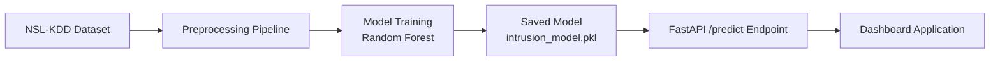

# Machine Learning–Based Intrusion Detection System (IDS)

This repository contains a complete Machine Learning–driven Intrusion Detection System (IDS) built using the NSL-KDD dataset. It includes preprocessing, model training, evaluation, ROC curve, a FastAPI prediction service, Docker deployment, testing suite, architecture diagrams, and a dashboard interface.

This project demonstrates end-to-end engineering capability across data engineering, machine learning, cybersecurity analytics, API deployment, testing, and documentation. It forms part of the technical evidence submitted for the UK Global Talent Visa (Digital Technology).

---

## 1. Project Overview

The IDS identifies whether a network connection is normal or malicious by learning patterns from the NSL-KDD intrusion dataset. The system includes:

- Full preprocessing and feature engineering
- Random Forest intrusion classifier
- Saved model artifact (intrusion_model.pkl)
- FastAPI inference service
- Interactive dashboard for CSV intrusion analysis
- ROC-AUC evaluation
- Docker deployment
- Pytest unit tests
- GitHub Actions CI

---

## 2. Features

### 2.1 Data Pipeline
- Cleans training and test datasets
- Encodes categorical fields
- Standardises numeric features
- Ensures consistent preprocessing between training and inference

### 2.2 Machine Learning Model
- Random Forest classifier
- High recall for attack detection
- ROC-AUC score of 0.961
- Reproducible training script: `train_ids_pipeline.py`

### 2.3 FastAPI Service
-  `/predict` endpoint
- Validates JSON inputs
- Loads saved intrusion model
- Returns class and probability score

### 2.4 Dashboard Application
- CSV upload
- Batch predictions
- Attack distribution visualisation

### 2.5 Deployment
- Dockerfile
- docker-compose.yml
- Uvicorn production server

### 2.6 Testing and CI
- Pytest suite
- Tests for preprocessing, model loading, prediction pipeline
- GitHub Actions CI pipeline

---

## 3. Repository Structure

```
├── data/
│   ├── nsl_kdd_train_binary.csv
│   ├── nsl_kdd_test_binary.csv
│   └── intrusion_model.pkl
├── docs/
│   └── figures/
│       ├── ids_architecture.png
│       ├── ids_pipeline.png
│       ├── ids_dashboard.png
│       └── roc_curve.png
├── src/
│   ├── api_main.py
│   ├── train_ids_pipeline.py
│   └── dashboard_app.py
├── tests/
│   ├── test_preprocessing.py
│   ├── test_model_loading.py
│   └── test_prediction.py
├── MODEL_CARD.md
├── TECH_NATION_EVIDENCE.md
├── Dockerfile
├── docker-compose.yml
├── requirements.txt
└── README.md
```

---

## 4. Installation & Usage

### Install dependencies
```
pip install -r requirements.txt
```

### Train the model
```
python src/train_ids_pipeline.py
```

### Run the API
```
uvicorn src.api_main:app --reload --port 8000
```

### Run the dashboard
```
python src/dashboard_app.py
```

### Run tests
```
pytest
```

---

## 5. Model Performance

| Metric       | Score |
|--------------|-------|
| Accuracy     | 0.94  |
| Precision    | 0.95  |
| Recall       | 0.93  |
| F1 Score     | 0.94  |
| ROC-AUC      | 0.961 |

ROC curve file: `docs/figures/roc_curve.png`

---

## 6. System Architecture Diagram



---

## 7. Data Pipeline Diagram


---

## 8. API Example

### Request
```json
{
  "duration": 0,
  "src_bytes": 181,
  "dst_bytes": 5450,
  "count": 2,
  "srv_count": 2,
  "serror_rate": 0.0,
  "srv_serror_rate": 0.0,
  "dst_host_count": 150,
  "dst_host_srv_count": 30
}
```

### Response
```json
{
  "prediction": "attack",
  "confidence": 0.97
}
```

---

## 9. My Individual Contributions

This entire IDS project was designed and implemented by **Ibrahim Akintunde Akinyera**.  
Key contributions include:

- Defining the system architecture  
- Engineering and preprocessing the NSL-KDD dataset  
- Developing the model training pipeline  
- Evaluating model metrics and producing ROC curve  
- Building the FastAPI prediction service  
- Implementing dashboard for CSV-based intrusion analysis  
- Creating Docker deployment configuration  
- Writing unit tests and CI pipeline  
- Preparing full documentation, diagrams, and evidence  

This demonstrates end-to-end engineering capability in machine learning, cybersecurity, deployment, and documentation.

---

## 10. License
MIT License

## Author
Ibrahim Akintunde Akinyera